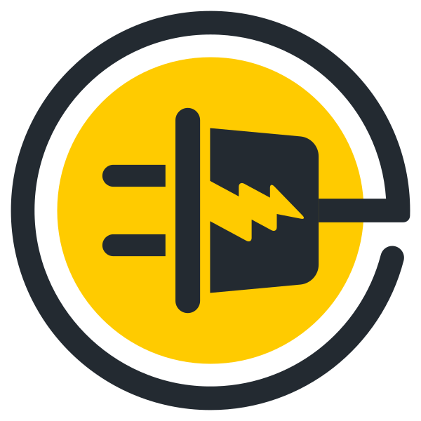

  

<h1 align="center">⚡ ECS</h1>
<h2 align="center">Simulador de Consumo Energético</h2>

<h4 align="center"> 
	🚧 ECS 🚀 Em construção... 🚧
</h4>

Tabela de conteúdos
=================
<!--ts-->
   * [Sobre o projeto](#-sobre-o-projeto)
   * [Funcionalidades](#-funcionalidades)
   * [Tecnologias](#-tecnologias)
   * [Como usar](#-comousar)
   * [Metodologia](#-metodologia)
   * [Autor](#-autor)
   * [Licença](#user-content--licença)
<!--te-->

## 💻 Sobre o projeto

💬 WebChat - é um sistema de troca de mensagens instantânea por meio da internet, semelhante ao whatsapp e direct do instagram.

---

## ⚙️ Funcionalidades

- [ ] Adicionar amigos
  - [ ] enviar pedidios de amizade
  - [ ] aceitar ou recusar os pedidios de amizade

- [ ] Conversas individuais:
  - [ ] mandar texto e arquivos para um amigo
     
- [ ] Conversas em grupos:
  - [ ] criar grupos para conversar com amigos de forma semelhante as conversas individuais
  - [ ] aceitar ou recusar convites para grupos

---

## 🛠 Tecnologias

As seguintes ferramentas foram usadas na construção do projeto:

#### **Website**  ([Next.js](https://nextjs.org/)  +  [TypeScript](https://www.typescriptlang.org/))

#### **API**  ([Nestjs](https://nestjs.com/)  +  [MongoDB](https://www.mongodb.com/pt-br))

#### **Utilitários**

-   Protótipo:  **[Figma](https://www.figma.com/)**  →  **[Protótipo (Portifolio)](https://www.figma.com/file/YZwqjkUv4kkD1XAkMTnFPI/WebChat)**
-   Editor:  **[Visual Studio Code](https://code.visualstudio.com/)**
-   Ícones:  **[Font Awesome](https://fontawesome.com/)**
-   Fontes:  **[Amiko](https://fonts.google.com/specimen/Amiko)**

---

## 🙋‍♂️ Autor

<a href="https://github.com/fnmatheus">
 
  
 
Matheus Nascimento

  
</a>

 

---

## 📝 Licença

Este projeto esta sobe a licença [MIT](./LICENSE).

Feito por Matheus Nascimento 👋🏽 [Entre em contato!](https://www.linkedin.com/in/fnmatheus/)

---
